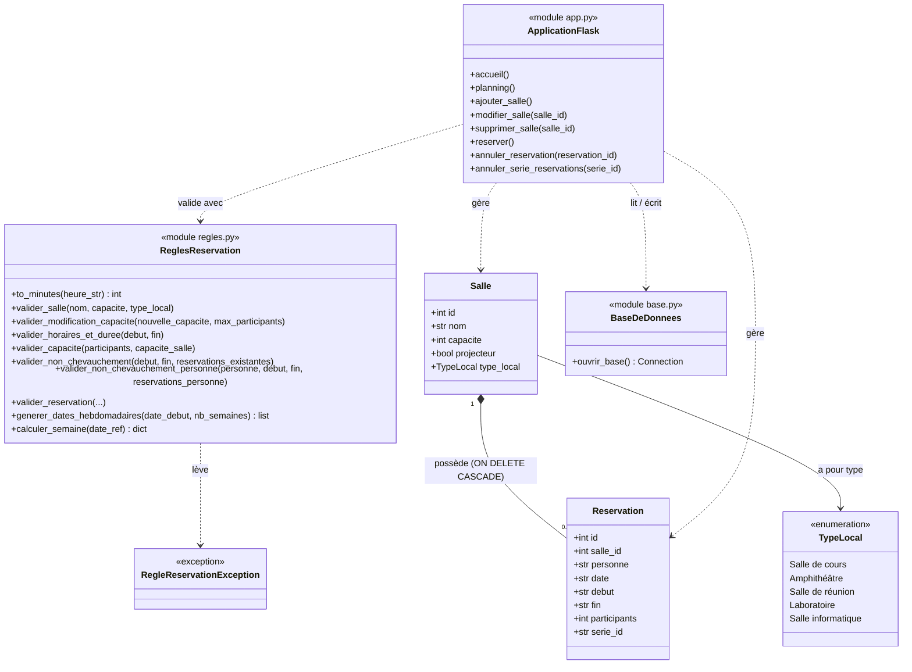

# Diagramme de classes — Réservation de salles

```mermaid
classDiagram
    class TypeLocal {
        <<enumeration>>
        Salle de cours
        Amphithéâtre
        Salle de réunion
        Laboratoire
        Salle informatique
    }

    class Salle {
        +int id
        +str nom
        +int capacite
        +bool projecteur
        +TypeLocal type_local
    }

    class Reservation {
        +int id
        +int salle_id
        +str personne
        +str date
        +str debut
        +str fin
        +int participants
        +str serie_id
    }

    class RegleReservationException {
        <<exception>>
    }

    class ReglesReservation {
        <<module regles.py>>
        +to_minutes(heure_str) int
        +valider_salle(nom, capacite, type_local)
        +valider_modification_capacite(nouvelle_capacite, max_participants)
        +valider_horaires_et_duree(debut, fin)
        +valider_capacite(participants, capacite_salle)
        +valider_non_chevauchement(debut, fin, reservations_existantes)
        +valider_non_chevauchement_personne(personne, debut, fin, reservations_personne)
        +valider_reservation(...)
        +generer_dates_hebdomadaires(date_debut, nb_semaines) list
        +calculer_semaine(date_ref) dict
    }

    class BaseDeDonnees {
        <<module base.py>>
        +ouvrir_base() Connection
    }

    class ApplicationFlask {
        <<module app.py>>
        +accueil()
        +planning()
        +ajouter_salle()
        +modifier_salle(salle_id)
        +supprimer_salle(salle_id)
        +reserver()
        +annuler_reservation(reservation_id)
        +annuler_serie_reservations(serie_id)
    }

    Salle "1" *-- "0..*" Reservation : possède (ON DELETE CASCADE)
    Salle --> TypeLocal : a pour type
    ApplicationFlask ..> BaseDeDonnees : lit / écrit
    ApplicationFlask ..> ReglesReservation : valide avec
    ApplicationFlask ..> Salle : gère
    ApplicationFlask ..> Reservation : gère
    ReglesReservation ..> RegleReservationException : lève
```
